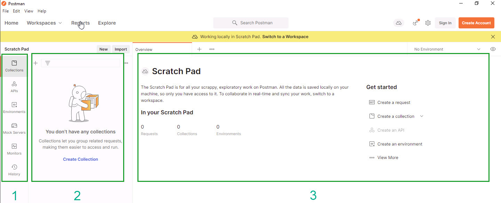

# 002 - Exploring Postman

## Start the Postman application

When [Postman](https://www.postman.com/) loads you are placed into the Collections window.  Collections allow you create groups of objects like API requests in the order you wish them to be.  Skillable provide a Collection of objects for all the Skillable LOD API requests.  

The picture above shows the 3 main working areas or Postman:

1. The applications primary functions - we will only be using collections
1. The Function navigation panel
1. The Details panel related to the function when run.

## Lets register the Skillable collections

- [] From just above the **Collections** panel click the Import button:
- [] Click **Link**
- [] Enter the following link into the box: +++https://docsmirror.blob.core.windows.net/learnondemandsystems-docs-master/lod/lod-api/lab-on-demand.postman_collection.json+++
- [] Press **Continue**
- [] Notice the wizard shows the Lab On Demand API Connection.  Click **Import**

Notice the Lab On Demand Postman Collection is now listed in the Collections Panel.  Expand the list to see all the API commands available.

>[!Help]
 Where did that link come from?

>

  The link is listed on the Skillable LOD API Documentation Page.  Because of the Postman version we used the 2.1 release
  

Repeat the procedure to add the TMS API commands.  The URL can be found here: +++https://lms.learnondemand.net/ApiDocumentation+++

>[!Hint] Remember you need the JSON file.

You should now have two collections listed: 

Press **next** to continue
