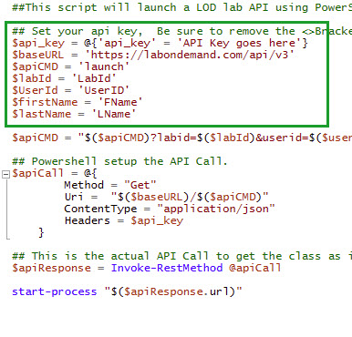

### Scenario

Using PowerShell you will modify a script to launch a lab as a demonstraton.  The script could be used as the basis of creating scripts for any API capability.

 - [] From the Desktop right click the **LODLaunchLab** shortcut and select **Edit**
 - [] You will notice a number of variables at the top of the file, these will need to be edited.

 - [] Set the variables to the following values:

| Variable | Value |
| ------ | ------|
| api_key |+++@lab.Variable(api_key)+++|
| labId | +++116785+++ |
| userID | +++@lab.User.Email+++ |
| firstName | +++@lab.User.FirstName+++ |
| lastName | +++@lab.User.LastName+++ |

 - [] Review the script and notice the $apiCMD will represent the command sent and in the $apiCall it has a **Headers** value for the API Key
 - [] Save the file
 - [] Run the script  
 - [] Notice the browser open to start the lab.  Ed the lab straight away, it will not perform well as the VM does not have GPU Hardware.
 - [] Switch back to the PowerShell ISE
 - [] In the blue command prompt window type: +++$baseURL+++ press enter
 - [] Then type +++$apiCMD+++ press enter

Notice the two respnses added together contains the URL to be sent to the LOD API endpoint.

 - [] Type +++$apiResponse+++ press enter

Notice the $apiResponse variable contains the response from the LOD API launch command.  

Because PowerShell understands the response is in JSON, PowerShell formats it into objects which makes it easy to consume later in a script, for example type +++$apiResponse.LabInstanceId+++ and notice just the lab instance id is returned.

 - [] Let the instructor know you have finished Lab 4 and press submit to complete the lab.
